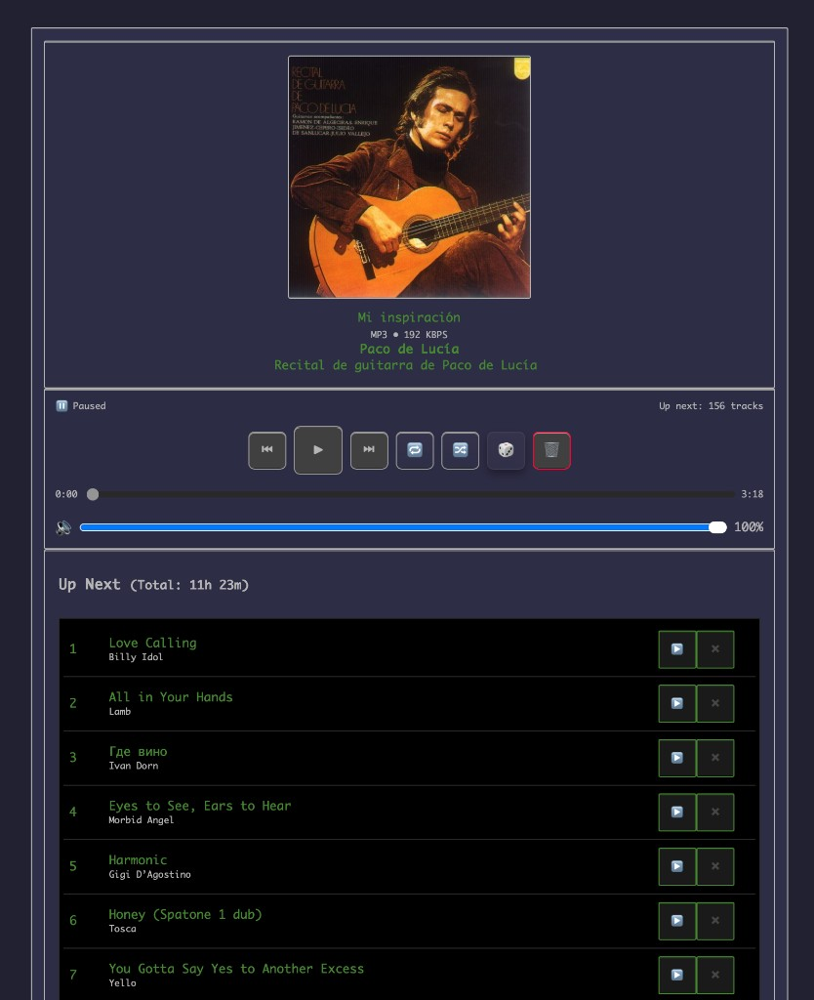

# 🎵 Kneep — Navidrome Jukebox Web Player

A retro-styled web interface for controlling [Navidrome](https://www.navidrome.org/)'s Jukebox mode. Manage music playback on your server from any device — with a classic Winamp aesthetic.


## Screenshot



## Features

- ~~**🎨 Modern UI** — Beautiful glassmorphic design with smooth animations~~ Old classic Winamp style 😜
- **Jukebox Control** — Play, pause, skip, shuffle, repeat, volume
- **Drag & Drop Queue** — Reorder your playlist with drag and drop
- **Library Search** — Real-time search, click to add
- **Random Song** — Add random tracks with one click
- **🤖 AI Playlist** — Generate 100-track queue from your Last.fm top artists (500+ scrobbles)
- **💎 Discovery Playlist** — Hidden gems: 100 random tracks from artists with <500 scrobbles
- **Last.fm Scrobbling** — Automatic scrobble with tab-hidden catch-up
- **Album Art** — High-quality cover art display
- **Media Session API** — Control from OS media keys / lock screen
- **Responsive** — Desktop, tablet, and mobile
- **Docker + HTTPS** — Production-ready with Nginx reverse proxy

## Prerequisites

- [Navidrome](https://www.navidrome.org/) server with Jukebox mode enabled
- [Docker](https://www.docker.com/) and Docker Compose
- [Node.js](https://nodejs.org/) 18+ (for development)
- [MPV](https://mpv.io/) player and ALSA audio on the server
- SSL certificates (optional, for HTTPS)

## Quick Start

```bash
git clone https://github.com/bgpntx/kneep.git
cd kneep
cp .env.example .env    # Edit with your Last.fm keys
```

### Configure

1. Edit `docker-compose.yml` — update volume paths for your music library and data directory
2. Edit `navidrome.toml` — set audio device, jukebox settings, scanner schedule
3. Edit `nginx.default.conf` — update `server_name` and SSL certificate paths

### Build & Deploy

```bash
npm ci
npm run build
docker compose up -d
```

Or use the rebuild script for a full clean deploy:

```bash
bash rebuild.sh
```

### Access

| Port | Protocol | Description |
|------|----------|-------------|
| 8080 | HTTP | Web interface (redirects to HTTPS) |
| 8443 | HTTPS | Web interface |
| 4533 | HTTPS | Navidrome API proxy |

## Development

```bash
npm install
npm run dev       # http://localhost:5173
```

The dev server proxies `/rest/*` to `localhost:4533`, `/lastfm/*` to Last.fm API, and `/anthropic/*` to Anthropic API (configurable in `vite.config.js`).

## Project Structure

```
kneep/
├── public/                    # Static assets
├── src/
│   ├── api/
│   │   ├── subsonic.js        # Subsonic API client (auth, jukebox, scrobble)
│   │   └── lastfm.js          # Last.fm API client (top artists, discovery)
│   ├── components/
│   │   └── QueueItem.jsx      # Drag & drop queue item
│   ├── utils/
│   │   ├── helpers.js         # Time formatting
│   │   ├── md5.js             # MD5 hash (Subsonic auth requirement)
│   │   └── playbackManager.js # Playback state persistence
│   ├── App.jsx                # Main application component
│   ├── App.css                # Styles
│   └── main.jsx               # Entry point
├── docker-compose.yml         # Docker services
├── Dockerfile                 # Navidrome + MPV image
├── Jenkinsfile                # CI/CD pipeline
├── nginx.default.conf         # Nginx proxy config
├── navidrome.toml             # Navidrome config
├── rebuild.sh                 # Production rebuild script
└── vite.config.js             # Vite config
```

## Architecture

```
┌──────────────────────────────────────────────┐
│  Docker Compose                              │
│                                              │
│  ┌────────────────────────────────────────┐  │
│  │  Nginx (nginx:alpine)                  │  │
│  │  :8080 HTTP → HTTPS redirect           │  │
│  │  :8443 HTTPS → serves React SPA        │  │
│  │  :4533 HTTPS → proxy to Navidrome      │  │
│  └──────────────┬─────────────────────────┘  │
│                 │                             │
│  ┌──────────────▼─────────────────────────┐  │
│  │  Navidrome (navidrome-mpv)             │  │
│  │  :4533 internal                        │  │
│  │  Jukebox API → MPV → ALSA → /dev/snd  │  │
│  └────────────────────────────────────────┘  │
└──────────────────────────────────────────────┘
```

## Configuration

### Environment Variables (`.env`)

```bash
LASTFM_API_KEY=your_key    # Last.fm API key (for Navidrome scrobbling)
LASTFM_SECRET=your_secret  # Last.fm secret (for Navidrome scrobbling)
```

### AI Playlist Setup

The 🤖 button generates a 100-track queue from your Last.fm listening history. Configuration is done in the browser UI (stored in localStorage):

1. **Last.fm Username** — your Last.fm profile name
2. **Last.fm API Key** — get one at [last.fm/api](https://www.last.fm/api/account/create)

The 🤖 feature fetches your top artists with 500+ scrobbles, finds their tracks in Navidrome, and randomly picks 100 to add to the queue.

The 💎 Discovery button does the inverse — it picks from artists with fewer than 500 scrobbles, surfacing tracks you rarely listen to.

### Navidrome (`navidrome.toml`)

Key settings:

| Setting | Default | Description |
|---------|---------|-------------|
| `Jukebox.Enabled` | `true` | Enable server-side playback |
| `Jukebox.Devices` | `U24XL` | ALSA audio device name |
| `SessionTimeout` | `24h` | Authentication session lifetime |
| `Scanner.Schedule` | `@every 24h` | Library scan interval |

### First-Time Login

1. Open the web player
2. Enter your Navidrome **username** and **password** at the bottom
3. Leave **Server URL** empty if using the Nginx proxy

## Troubleshooting

### No Audio

```bash
docker exec navidrome which mpv          # Check MPV installed
docker exec navidrome aplay -L           # List audio devices
ls -l /dev/snd/                          # Check device permissions
docker compose logs -f navidrome         # Check logs
```

### Authentication Issues

- Check that Navidrome is reachable at the configured URL
- Clear browser localStorage and re-login
- Check `SessionTimeout` in `navidrome.toml`

### Docker Issues

```bash
docker compose ps                        # Container status
docker compose logs -f                   # All logs
docker compose build --no-cache && docker compose up -d  # Full rebuild
```

### Permission Denied on `/dev/snd`

```bash
sudo usermod -aG audio $(whoami)         # Add user to audio group
getent group audio                       # Verify audio GID matches docker-compose.yml
```

## Security

- Token/salt auth follows [Subsonic API](http://www.subsonic.org/pages/api.jsp) standard
- Credentials stored in browser `localStorage` (no server-side session)
- HTTPS via Let's Encrypt
- Music library mounted read-only
- CORS restricted to configured origin

## License

[MIT](LICENSE)

## Acknowledgments

- [Navidrome](https://www.navidrome.org/) — Music server
- [React](https://react.dev/) — UI framework
- [Vite](https://vitejs.dev/) — Build tool
- [MPV](https://mpv.io/) — Media player
- [@dnd-kit](https://dndkit.com/) — Drag and drop
